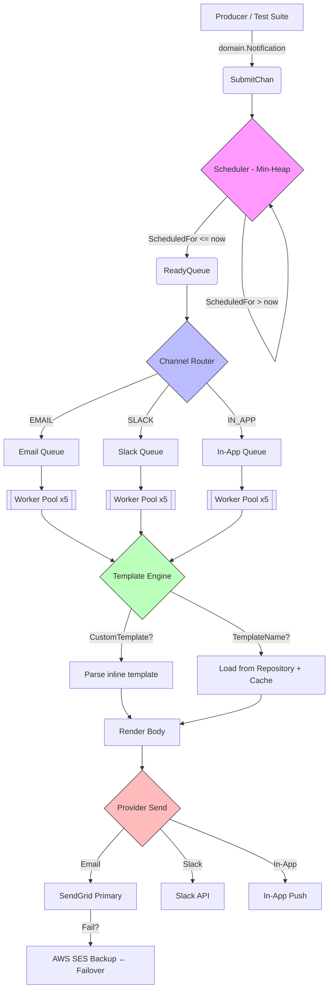

# Notification Service

A high-performance, multi-channel notification engine built in **Go**. It features scheduled & instant delivery, provider failover, concurrent worker pools, template rendering, and graceful shutdown — all wired together with clean architecture and classic design patterns.

---

## Table of Contents

- [Architecture Overview](#architecture-overview)
- [Workflow Diagram](#workflow-diagram)
- [How to Run Locally](#how-to-run-locally)
- [Functional Requirements — Progress Summary](#functional-requirements--progress-summary)

---

## Architecture Overview

```
┌────────────┐      ┌─────────────┐      ┌───────────────┐      ┌──────────────────┐
│  Producer   │─────▶│  Scheduler  │─────▶│  Dispatcher   │─────▶│  Channel Workers │
│ (SubmitChan)│      │ (Min-Heap)  │      │ (Router)      │      │  (Worker Pools)  │
└────────────┘      └─────────────┘      └───────────────┘      └────────┬─────────┘
                                                                         │
                                                          ┌──────────────┼──────────────┐
                                                          ▼              ▼              ▼
                                                    ┌──────────┐  ┌──────────┐  ┌──────────┐
                                                    │  Email    │  │  Slack   │  │  In-App  │
                                                    │ Provider  │  │ Provider │  │ Provider │
                                                    │(Failover) │  │          │  │          │
                                                    └──────────┘  └──────────┘  └──────────┘
```

**Data Flow:**

1. **Submit** — Notifications are pushed into the `SubmitChan`.
2. **Schedule** — The Scheduler inserts each job into a min-heap, sorted by `ScheduledFor` time.
3. **Dispatch** — When a job's scheduled time arrives, it is popped from the heap and pushed to the `ReadyQueue`.
4. **Route** — The dispatcher reads from the `ReadyQueue` and fans out notifications into per-channel queues (`EMAIL`, `SLACK`, `IN_APP`).
5. **Execute** — A pool of workers per channel picks up jobs, renders templates, and delivers via the appropriate provider.

---

## Workflow Diagram



---

## How to Run Locally

### Prerequisites

| Tool | Version |
|---|---|
| **Go** | 1.25.4+ |
| **Git** | Any recent version |
| **OS** | Windows / macOS / Linux |

### Steps

**1. Clone the repository**

```bash
git clone <repository-url>
cd notification-service
```

**2. Verify Go installation**

```bash
go version
# Expected: go version go1.25.4 (or higher)
```

**3. Download dependencies**

```bash
go mod tidy
```

**4. Run the service**

```bash
go run main.go
```

The engine will start and immediately execute the built-in functional test suite (FR-01 through FR-14). You will see output like:

```
>>> NOTIFICATION ENGINE ONLINE | Multi-File Architecture
>>> RUNNING FULL FUNCTIONAL TEST SUITE (FR-01 to FR-14)...
      [FAILOVER] SendGrid_Primary failed, attempting next...
      [OUTPUT] AWS_SES_Ba -> user@mail.com   | "Hi Alice!"
      [OUTPUT] SLACK      -> #dev-ops-slack   | "Critical: Postgres Latency High"
      [OUTPUT] IN-APP     -> @mobile_uid_99   | "Hi Bob!"
      ...
```

**5. Stop the service**

Press `Ctrl+C` to trigger graceful shutdown:

```
>>> SIGINT/SIGTERM RECEIVED: Initiating Graceful Shutdown...
>>> SHUTDOWN COMPLETE: All jobs processed safely.
```


---

## Functional Requirements — Progress Summary

### ✅ Completed (FR-01 → FR-14)

| FR | Requirement | Status | What Was Built | Key Files |
|---|---|:---:|---|---|
| **FR-01** | Email channel routing | ✅ | `EmailDispatcher` with ordered provider list; per-channel buffered queue and dedicated worker pool | `provider/emailNotifier.go`, `service/notification.go` |
| **FR-02** | Slack channel routing | ✅ | `SlackNotifier` implementing the `Notifier` interface; routed via channel type | `provider/slackNotifier.go` |
| **FR-03** | In-App channel routing | ✅ | `InAppNotifier` implementing the `Notifier` interface; routed via channel type | `provider/inAppNotifier.go` |
| **FR-04** | Custom template override | ✅ | If `CustomTemplate` is set on a notification, it is parsed directly and the repository lookup is skipped | `service/notification.go` → `execute()` |
| **FR-05** | Instant & scheduled delivery | ✅ | `Scheduler` backed by a min-heap (`container/heap`); jobs with `ScheduledFor ≤ now` fire immediately, future jobs wait efficiently via `time.Timer` | `service/scheduler.go` |
| **FR-06** | Graceful shutdown | ✅ | `signal.NotifyContext` captures SIGINT/SIGTERM; context cancellation stops the scheduler and dispatcher; channel queues are closed and `sync.WaitGroup` waits for all workers to drain | `main.go`, `service/notification.go` → `Shutdown()` |
| **FR-07** | Provider failover (Email) | ✅ | `EmailDispatcher.Send()` iterates through providers in order; on failure it logs `[FAILOVER]` and tries the next provider until one succeeds or all are exhausted | `provider/emailNotifier.go` |
| **FR-08 – FR-14** | Concurrency & burst handling | ✅ | 5 worker goroutines per channel (configurable); 2000-capacity buffered channels provide back-pressure; burst test submits 7 parallel jobs across Slack and In-App channels | `service/notification.go` → `Start()`, `main.go` → `runTestSuite()` |

### 📊 Coverage at a Glance

```
Functional Requirements   [██████████████████████████████] 14 / 14  (100 %)

  Multi-Channel Routing    ✅  EMAIL · SLACK · IN_APP
  Template Engine          ✅  Repository lookup + Custom override + sync.Map cache
  Scheduling               ✅  Min-heap priority queue (instant & delayed)
  Provider Resilience      ✅  Ordered failover chain (SendGrid → AWS SES)
  Concurrency              ✅  Fan-out worker pools with buffered queues
  Graceful Shutdown        ✅  OS signal handling + WaitGroup drain
```

### 🏗 Design Patterns Employed

| Pattern | Where It's Used |
|---|---|
| **Strategy** | `Notifier` interface — each channel (Email / Slack / In-App) is a swappable strategy |
| **Repository** | `TemplateProvider` interface — decouples template storage from business logic |
| **Chain of Responsibility** | `EmailDispatcher` — cascading failover through a provider list |
| **Fan-Out / Worker Pool** | Per-channel goroutine pools consuming from buffered queues |
| **Priority Queue (Min-Heap)** | `Scheduler` — time-ordered job dispatch using `container/heap` |
| **Dependency Injection** | All providers, repo, and scheduler injected via `NewNotificationService()` |
| **Template Caching** | `sync.Map` stores compiled templates to avoid repeated parsing |
| **Graceful Shutdown** | `signal.NotifyContext` + `sync.WaitGroup` for safe process termination |
